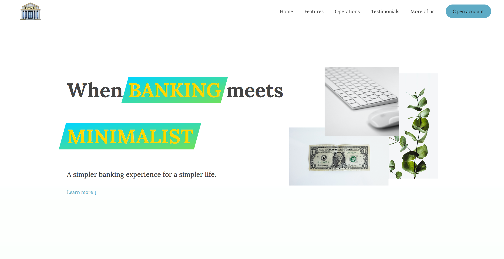
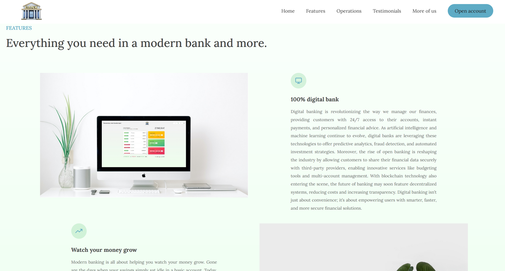
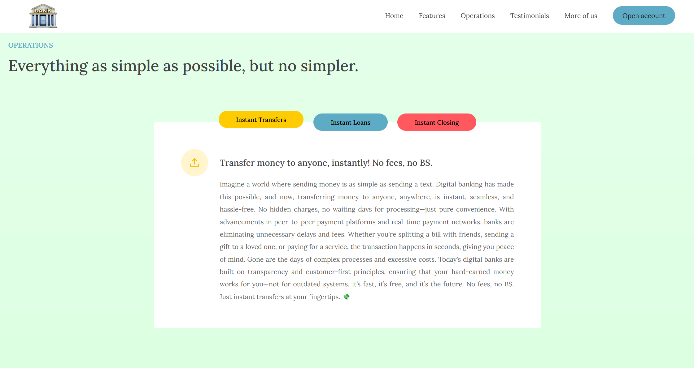
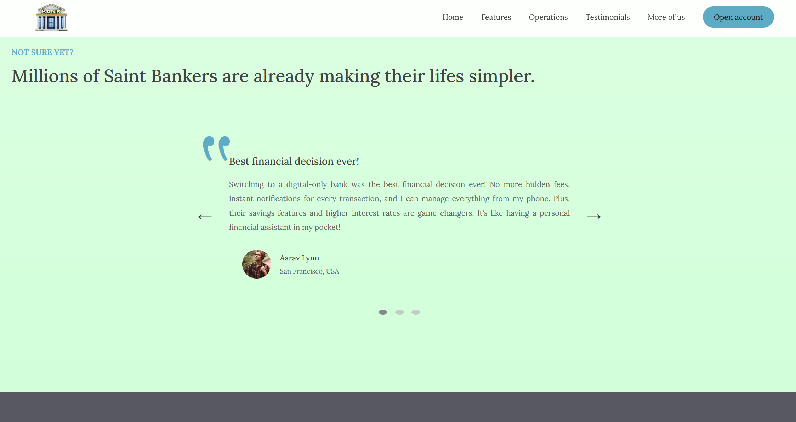

# What is this app?

&nbsp;&nbsp;👉 This is a pretty complete fake bank web page where you can take a look to the Saint Bank information and to know what this fake bank can do for you.

&nbsp;&nbsp;👉 Also you can see and discover some features about this web page like transitions, fade out information, a pop up windows with a form to can "open a new bank account", a slider and more.

&nbsp;&nbsp;👉 It is important to remark that all web page is made in local server and nothing you do inside the page is going to store. This is just a JavaScript code, on local development and at the momento I didn't do nothing on external server. I'm still learning 🤣🤣😅😅

&nbsp;&nbsp;👉 All script is commented to can understand step by step the code and to can run it, just clone or download the zip folder of the repository and open it with your favorite IDE, then finally execute the html with live server and enjoy trying this JavaScript web app; or you can click on the Surge web link to use it directly on your browser:<a target="_blank" href="https://saint-bank-website-vlaicu.surge.sh/" ><b>https://saint-bank-website-vlaicu.surge.sh/</b>

&nbsp;&nbsp;👉 Here you have some screen prints to preview the web site:

